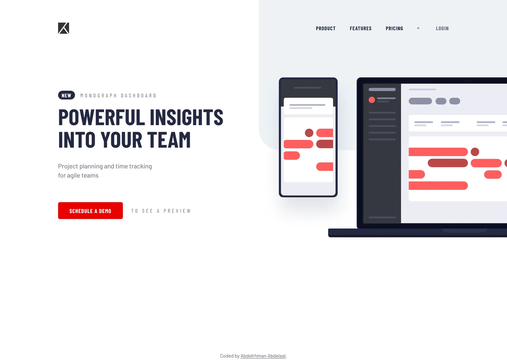

# Frontend Mentor - Project tracking intro component solution

This is a solution to the [Project tracking intro component challenge on Frontend Mentor](https://www.frontendmentor.io/challenges/project-tracking-intro-component-rv1UdCGgt). Frontend Mentor challenges help you improve your coding skills by building realistic projects.

## Table of contents

- [Overview](#overview)
  - [Screenshot](#screenshot)
  - [Links](#links)
- [My process](#my-process)
  - [Built with](#built-with)
  - [Design deviations](#design-deviations)
  - [Implementation notes](#implementation-notes)
- [Author](#author)

## Overview

### Screenshot

### Links

- Solution URL: [GitHub](https://github.com/MrBlackvanta/project-tracking-intro-component)
- Live Site URL: [Netlify](https://vanta-project-tracking-intro-componen.netlify.app)

## My process

### Built with

- [Next.js 16](https://nextjs.org/) (App Router, React Compiler, Turbopack)
- [React 19](https://react.dev/)
- [TypeScript](https://www.typescriptlang.org/) (strict)
- [Tailwind CSS v4](https://tailwindcss.com/)

### Design deviations

**Contrast, to reach 100 on Lighthouse accessibility.** Two pairings in the supplied
design sit below the WCAG AA threshold of 4.5:1 for body text. Each was darkened by the
smallest amount that clears it on its _worst_ backdrop — hue and saturation are untouched,
only lightness and opacity moved. Ratios below are measured from composited pixels, not
estimated.

|                                                   | design           | contrast                             | shipped           | contrast        |
| ------------------------------------------------- | ---------------- | ------------------------------------ | ----------------- | --------------- |
| Muted labels — eyebrow, "to see a preview", Login | `#242942` at 50% | 3.02:1 on white, 2.91:1 on the shape | `#242942` at 70%  | 5.45:1 / 5.14:1 |
| White label on the CTA                            | `#FF5E5E`        | 2.99:1                               | `hsl(0 100% 46%)` | 4.63:1          |

Two details worth knowing about those:

- **No red at this hue and saturation can carry a white label at AA.** Even pure
  `#FF0000` only reaches 4.0:1, so the surface has to drop below 50% lightness. The
  design's `#FF5E5E` is reused as the CTA's hover colour, which preserves the design's
  own lighten-on-hover direction (its hover state is the base red under a 25% white
  overlay). White on that hover is 2.99:1 — kept deliberately, since it matches the
  design and hover states are not audited, while the resting state passes.
- **`Login` is the pairing that forces 70%.** It is the only muted label that sits on the
  Light Grayish Blue shape rather than on white, and the shape costs roughly 0.25 of a
  ratio point. At 65% it passes on white (4.65:1) but fails on the shape (4.39:1).

**Body copy needed no change.** The design specifies `#242942` at 75%, which composites
to `#5B5F71` — identical to the style guide's Dark Grayish Blue `hsl(230 11% 40%)`, at
6.32:1. It uses the semantic token with no deviation.

**Two palette tokens carry one decimal place** so they render Figma's exact paints:
`--color-red: hsl(0 100% 68.4%)` → `#FF5E5E` and
`--color-light-grayish-blue: hsl(207 33% 94.7%)` → `#EDF2F6`. The style guide's rounded
68% and 95% would ship `#FF5C5C` and `#EEF3F7`.

### Implementation notes

**The background shape is drawn in code**, as the brief asks — a single decorative `div`
anchored top-right with a 60px bottom-left radius, scaled by percentage so the nav stays
over it at wide viewports.

**Line breaks are constrained widths, not ` `.** The design hard-breaks the headline
after "INSIGHTS" and the body after "tracking". Reproducing that with ` ` would
overflow narrow screens, so both wrap naturally inside a `max-width`. The headline's
constraint is in `em` rather than `px`: the design's own box (470px desktop, 311px mobile)
sits within a pixel of the longest line, so a px value risks flipping the break on
sub-pixel font-metric differences. `8.4em` resolves to 336px at the mobile 40px and 538px
at the desktop 64px — mid-band at both — so one declaration holds the two-line break from
375px upward with no breakpoint. Rendered line one measures 469.6px against the design's
470px.

**One breakpoint, `lg` (64rem).** Below it the layout is the mobile stack with a dropdown
menu; at and above it the illustration moves beside the copy. A single switch is enough,
and 1024px is the tightest case — the headline's ink clears the background shape by 13px
there.

**The illustration overflows the viewport at both breakpoints, by design.** Its SVG canvas
(960×464) is larger than the Figma group's bounding box (916×455) because of drop-shadow
filter bleed, so placement was derived from the laptop rectangle, which exists in both
coordinate spaces. The overflow is clipped on the page wrapper rather than on `body`:
`body`'s overflow is propagated to the viewport, which leaves `body` itself unable to clip
an absolutely positioned descendant.

## Author

- UpWork - [Abdelrhman Abdelaal](https://upwork.com/freelancers/~01f0a9479696b61f49)
- Frontend Mentor - [@MrBlackvanta](https://www.frontendmentor.io/profile/MrBlackvanta)
- LinkedIn - [Abdelrhman Abdelaal](https://www.linkedin.com/in/abdelrhman-vanta/)
